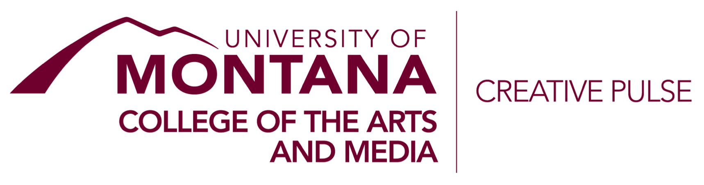

# Visual v. Acoustic Thinking | CP 582 - Creative Pulse Program

Date modified: June-17-2021

## Table of Contents

<!-- TOC depthFrom:1 depthTo:2 withLinks:1 updateOnSave:0 orderedList:0 -->

- [Course Overview](#course-overview)
    - [Basic Info](#basic-info)
    - [Professor/Instructor](#professorinstructor)
    - [Description](#description)
    - [Objectives & Student Learning Outcomes](#objectives--student-learning-outcomes)
    - [Course Modality/Format](#course-modalityformat)
    - [Course Websites](#course-websites)
    - [Pre-Requisites](#pre-requisites)
    - [Books, Supplies, & Technology](#books-supplies--technology)
- [Policies](#policies)
    - [Course Evaluation](#course-evaluation)
    - [Time & Effort](#time--effort)
    - [Grades](#grades)
    - [Attendance](#attendance)
    - [Zoom Related Information](#zoom-related-information)
    - [Academic Honesty, Plagiarism, and Cheating Policy](#academic-honesty-plagiarism-and-cheating-policy)
    - [Sensitive Subject Matter & Censorship](#sensitive-subject-matter--censorship)
    - [Be Kind](#be-kind)
    - [Diversity Statement](#diversity-statement)
    - [Students with Disabilities](#students-with-disabilities)
    - [COVID-19 Specific Information](#covid-19-specific-information)
    - [Changes to the Course](#changes-to-the-course)
- [Articles for Possible Reading or Additional Study](#articles-for-possible-reading-or-additional-study)

<!-- /TOC -->

# Course Overview

## Basic Info

- Name: Visual v. Acoustic Thinking
- Course Number: CP 582
- CRN: 50294
- Credits: 2
- Location: Ed 123
- Date/Time: TWRFM, 10:00am-2:00pm (June 22 - June 28)
- [Creative Pulse Summer Graduate Program - Masters of Arts in Integrated Arts and Education - University Of Montana](https://www.umt.edu/creativepulse/default.php)
- Insturctor Unit: [School of Visual and Media Arts (SVMA)](https://www.umt.edu/svma/), [College of the Arts and Media (CAM)](https://www.umt.edu/umarts/), [University of Montana](https://www.umt.edu)

## Professor/Instructor

- [Michael Musick, PhD](http://michaelmusick.com)
- E-Mail: [michael.musick@umontana.edu](mailto:michael.musick@umontana.edu?subject=mart500%20Question).
- Office: McGill Hall, 232.
- Appointment Link / Virtual Office Hours: Please talk to me in class or email for appointment.

## Description

This seminar explores visual (eye) vs acoustic (ear) learning, thinking, and teaching. By the end of this course, we will have examined how acoustic-based learning modalities and curriculum can be used to change how you deliver and conceptualize aspects of your teaching. Going further, we will utilize reading and analysis, experiential learning, writing, and practice-based research to consider how visual or acoustic thinking alter how we approach and engage our world. Supporting participants’ work as educators, we tie these ideas to learning styles and ways of knowing. In order to deepen our connection to acoustic ways of knowing, we will also engage in Deep Listening practices and theory, as pioneered by the seminal American artist and musician, Pauline Oliveros.

## Objectives & Student Learning Outcomes

Through this course, students are expected to demonstrate an ability to:

- Discuss how cultural and societal ways of thinking and knowing effect art and culture.
- Examine, compare, and contrast visual knowing against acoustic knowing.
- Propose plans for group based activities that utilize both ways of thinking.
- Develop familiarity with the basics of sound.
- Utilize modern artistic practices and tools to create an artistic work that responds to the class themes.
- Consider how Deep Listening and Soundscape practices can be utilized in teaching.

## Course Modality/Format

This course will be offered as an Face-to-Face experience. Students are expected to be present in class (unless previously cleared by the instructor). Likewise, as this is an intense experience that occurs over the course of one week, students should expect to immerse themselves in the contents of this course throughout the week. 

#### Course Recording

This serves as an explicit declaration that all courses may be recorded. These will then be available for further study at a later time by students of the course.

## Course Websites

This course will primarily utilize the University of Montana's Moodle platform. Students are expected to regularly check Moodle for course updates and content. 

In addition, wherever possible, content for this course will also be stored in a GitHub-based repository. This will provide a living location where students can access course materials after the course has concluded.

- [Course GitHub Repo (https://github.com/Montana-Media-Arts/CP582-Acoustic_v_Visual_Thinking)](https://github.com/Montana-Media-Arts/CP582-Acoustic_v_Visual_Thinking)

## Prerequisites

There are no prerequisites  for this course. This course is restricted to graduate students.

## Readings, Supplies, & Technology

### Readings

All readings will be provided to students through the course Moodle. 

#### Recommended Books

- Idhe, Don. 1976. _Listening and Voice: Phenomenologies of Sound._ 2nd Edition. Albany, NY, USA: State University of New York Press. https://doi.org/10.1007/s007690000247.
- Chion, Michel, and Claudia Gorbman. 1994. _Audio-Vision: Sound on Screen._  New York, NY, USA: Columbia University Press. https://doi.org/10.7312/chio18588.
- Cox, Christoph, and Daniel Warner, eds. 2004. _Audio Culture: Readings in Modern Music._ New York, NY, USA: Bloomsbury Academic. 

### Computer

You are expected to bring your laptop computer to class with you. We will do a number of projects that require your computer. 

I also think it is important that you create a knowledge ecosystem where your computer serves as a natural extension. In support of this, I highly suggest you take notes on your computer.

#### Mobile Phone

We will also be using your mobile phones to do some of our work. Please bring these to class.

#### Headphones

Although not required, if you have headphones, I suggest you bring them to class.

#### Software

We will utilize a number of software programs in this course.

- Cockos' Reaper [https://www.reaper.fm](https://www.reaper.fm)
- Shure's [Shureplus MOTIV Recording App - https://www.shure.com/en-US/products/software/shure_plus_motiv](https://www.shure.com/en-US/products/software/shure_plus_motiv)
- [RefWorks - https://refworks.proquest.com](https://refworks.proquest.com)

I also encourage you to find a note taking software platform that feels comfortable to you. Examples include:

- [Bear (mac only)](https://bear.app)
- [Microsoft's OneNote (free through UM)](https://www.microsoft.com/en-us/microsoft-365/onenote/digital-note-taking-app)

#### Reference Management Software

I suggest you start using a reference management software package of some sort.

Suggested:

- RefWorks (Available through the [Montana Library](https://libguides.lib.umt.edu/citation/RefWorks)
- [Mendeley - Reference Management Software & Researcher Network](https://www.mendeley.com)

## Basic Course Outline/Schedule

- **Tuesday** 
	- What is Sound
	- Introduce _acoustic vs. visual thinking_ principles
- **Wednesday**
	- Noise
	- Soundscape
	- Immersive Audio
	- Sonification and Auditory Displays
	- Sound Technology
	- Introduction to the DAW and mobile recording
- **Thursday**
	- Deep Listening
	- Mcluhan's Village
	- Psychoacoustics and Ear Health
	- Initial soundscape sketches
- **Friday**
	- Research, the Library, and Citations
	- Final project specifications
	- Group Deep Listening
- **Monday**
	- Final project presentations and critique

# Policies

## Course Evaluation

Student work and progress will be assessed through:

- In-class discussions and critiques
    - You are expected to engage with class discussions about technical and artistic issues.
    - You are expected to engage with class discussions about outside readings, viewing, and/or listenings.
    - You are expected to engage in the final class critique.
- In-class participation
	- You are expected to engage with in-class activities. 
- Project
    - You are expected to create at least one artwork during this course that emerges as a result of your engagement with sonic and acoustic thinking.
- Project Documentation
	- This project will require a written reflection.
	- This project will also require an annotated bibliography of sources that influenced the work.

#### Participation

This class will be participatory, and you are expected to participate in discussions and give feedback to other students.

## Time & Effort

This is a rigorous graduate course that requires appropriate time and effort to earn 2 graduate credits.

## Grades

#### Final Grades

Grades will be determined according to the following breakdown:

- In-class discussions, participation, and critiques: 25%
- Final Artistic Work: 50%
- Supporting Materials for Final Artistic Work (written response and bibliography): 25%

Letters are assigned according to the following final course percentages:

| Grade | % Range 	|
|:-----:|:---------:|
| A  	| `[93-100]`|
| A- 	| `[90-93)`	|
| B+ 	| `[87-90)`	|
| B  	| `[83-87)`	|
| B- 	| `[80-83)`	|
| C+ 	| `[77-80)`	|
| C  	| `[73-77)`	|
| C- 	| `[70-73)`	|
| D  	| `[60-70)`	|
| F  	| `[0-60)`	|

#### Late Work

IMPORTANT: Since projects are experienced as a group in class or through a public presentation, late projects are not permissible and will not be accepted.

Documentation assignments will not be accepted late either, unless extenuating circumstances occur. 

## Attendance

- Attendance will be taken at the beginning of every class
- All class days are mandatory
- Contact me in advance if you will not be in class. (email is preferred)
- Unexcused absences will affect your grade.

## Academic Honesty, Plagiarism, and Cheating Policy

Students are expected to adhere to academic conduct policies of the University of Montana as explained in Section V of your [University of Montana Student Conduct Code](http://www.umt.edu/student-affairs/dean-of-students/Student%20Conduct%20Code%20-%20FINAL%20-%208-24-18.pdf):  “Academic misconduct is subject to an academic penalty by the course instructor and/or a disciplinary sanction by the University.  Academic misconduct is defined as all forms of academic dishonesty, including but not limited to:  (1) plagiarism, (2) misconduct during an examination or academic exercise, (3) unauthorized possession of examination or other course materials, (4) tampering with course materials, (5) submitting false information, (6) submitting work previously presented in another course, (7) improperly influencing conduct, (8) substituting, or arranging substitution, for another student during an examination or other academic exercise, (9) facilitating academic dishonesty, and (10) Altering transcripts, grades, examinations, or other academically related documents.”

Dishonesty will not be tolerated in this course. This includes, but is not limited to, cheating on tests, cheating on assignments, fabricating information or citations, having unauthorized possession of examinations, submitting work of another person or work previously used, or tampering with the academic work of other students.

Plagiarism is the presentation of the work of another without acknowledgment. As defined by the [University of Montana’s Student Conduct Code](http://www.umt.edu/vpsa/policies/default.php), plagiarism is “Representing another person's words, ideas, data, or materials as one's own.”  Students may use information and ideas expressed by others, but this use must be identified by appropriate referencing.

Students who cheat or plagiarize will receive academic sanctions, which may include an “F” grade on the assignment, examination, and/or in the course. Students will also be reported to the Dean of Students for possible further disciplinary action.

#### Using Code or Media Found Elsewhere

It is easy to find code and media (i.e. videos, sounds, images, etc.) online. If you use code or media from elsewhere (which you will at times), I expect you to cite the work and author.

If you use found code, you are expected to comment each line, as to what each line does programmatically. _Do not_ summarize several lines of code from a high level (i.e., TV Guide). I expect you to comment each line on a granular level. In addition, in these cases, I am also looking for significant modification of the code, for you to enact your own ideas and to experiment heavily. Significant modification means beyond variable name and value changes. It is bending these concepts to your idea, especially graphically. It is not a copy and paste job. Also, never more than 40% of your code may be supplied from elsewhere. Period. If you use code from online, whether for inspiration, modification or reference, I expect to see a link in your comments from where you got the code and who wrote it. Otherwise it will be considered as plagiarism, and you will fail the assignment. The code must have a reference, along with URL and be commented out LINE BY LINE.

If you use found media, *YOU* are responsible to ensure it is used according to fair-use guidelines. The pieces you make in this course are intended to be portfolio-quality works. Therefore, you should not utilize found media with restrictive use guidelines or licenses. You can read more about various licenses at;

- [opensource.guide](https://opensource.guide/legal/)
- [choosealicense](https://choosealicense.com)
- [GNU Licenses](https://www.gnu.org/licenses/licenses.en.html)
- [Creative Commons Licenses](https://creativecommons.org/share-your-work/licensing-types-examples/)
- [opensource.org](https://opensource.org/licenses)

For found media, you are also expected to cite the media in your documentation for the project.

## Sensitive Subject Matter & Censorship

This course operates under a no censorship policy, and you should feel free to experiment with challenging topics in your projects. That said - if you submit work with violent or sexually explicit themes, containing hate speech, racial slurs or other sensitive subject matter, I might contact you to request more background information on your choices.

## UM Land Acknowledgment Statement
The University of Montana acknowledges that we are in the aboriginal territories of the Salish and Kalispel people. Today, we honor the path they have always shown us in caring for this place for the generations to come.

## Be Kind

Be respectful to each other, help each other, and be considerate in your communications with the instructional team.  No trolling shared work and ideas. Be constructive with any critical feedback you give.

## Diversity Statement

All students are capable of learning through inquiry and innovation; all students deserve fairness in areas including, equity, confidentiality, academic assessment, and amongst their peers. We are committed to respecting diversity by valuing the experiences and world views of our assembled cohort.

Your experience in this class is important to me.  I welcome individuals of all backgrounds, beliefs, ethnicities, genders, gender identities, gender expressions, races, national origins, religious affiliations, sexual orientations, ages, abilities, and other visible and nonvisible differences. Please know that I will gladly honor your request to address you by an alternate name or gender pronoun. All members of this class are expected to contribute to a welcoming, respectful, and inclusive environment for every other member of this class.

## Students with Disabilities

The University of Montana assures equal access to instruction through collaboration between students with disabilities, instructors, and Disability Services for Students. Students with disabilities are encouraged to plan ahead and can contact [Disability Services for Students (DSS)](http://www.umt.edu/dss/). Students with disabilities may request reasonable accommodations by contacting me. The University of Montana assures equal access to instruction for students with disabilities in collaboration with instructors and Disability Services for Students, which is located in Lommasson Center 154. The University does not permit fundamental alterations of academic standards or retroactive modifications. 

## Changes to the Course

I reserve the right to change the intended content of this course throughout the semester. This may be done to adjust for the speed of the class, to better meet educational goals, or to account for changes in technology.

